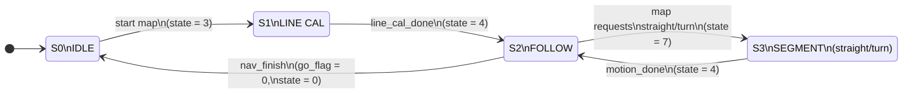

# ME405 Romi Project

## Overview

This repository contains the software and documentation for a MicroPython Romi robot designed for autonomous navigation using cooperative multitasking, motor control, and onboard sensors. The robot was built using a Nucleo L476RG microcontroller. The line sensor and bump sensors were purchased through Pololu.

The project was completed collaboratively by **Eric Lee, Roman Ruettimann, and Jonathan Enrique Corvera**, with all members contributing equally to both hardware and software development.

---

## Project Goals and Features

The primary goal of this project was to design a Romi robot capable of reliably completing a multi-checkpoint course using only onboard sensing and state estimation. The robot must:

- Follow taped lines
- Navigate sections without lines
- Detect and react to physical obstacles
- Operate fully autonomously

A key design decision was to implement the entire system using **cooperative multitasking**. Each subsystem (line following, state estimation, bump sensing, mapping, and velocity control) is implemented as an independent task with shared variables. This keeps the system modular, debuggable, and easy to tune. For map segments the robot uses an observer-based straight/turn primitive, and a dedicated bump task performs a scripted backup–turn–arc maneuver whenever an obstacle is detected.

---

## Installation Instructions

All Python files in the `compile` folder are required to run the Romi system and should be copied directly onto the Nucleo board via USB. The `main.py` file serves as the entry point and manages all tasks and shared variables.

A terminal emulator such as **PuTTY** was used to interact with the robot. Use the following settings:

- Baud rate: **115200**
- `Ctrl + C`: Interrupt execution
- `Ctrl + D`: Reboot the system after code changes

---

## Map Course Description

### Course Layout

The course shown below is the track the Romi was required to navigate. Black dots represent checkpoints. Red cups placed inside dotted circles incur a time penalty if displaced. Each major checkpoint and feature on the map is associated with a specific state in the map navigation finite state machine.

### Romi Robot

The Romi robot used in this project is shown below.

The photos highlight the line sensor bar at the front, the IMU mounted near the chassis center, and the compact wiring layout that keeps encoder, motor, and bump-sensor connections short and accessible.

---

## Hardware Architecture Summary

The system is built around the **Nucleo L476RG**, which interfaces with:

- Integrated Romi motors and encoders
- 5-channel IR line sensor
- BNO055 IMU
- Bump switches
- Bluetooth module

Sensors are mounted to maximize visibility of the track and obstacles, with short wiring runs for reliability and ease of servicing. Motor power is provided through DRV8838 motor drivers controlled by PWM outputs from the Nucleo, and the Bluetooth module is reserved for runtime monitoring and future user-interface extensions.

---

## Component List

| Quantity | Component |
|---------:|----------|
| 4 | M2.5 × 8 mm Standoff |
| 4 | M2.5 × 10 mm Standoff |
| 4 | M2.5 × 30 mm Standoff |
| 4 | M2.5 × 6 mm Socket Head Cap Screw |
| 4 | M2.5 × 8 mm Socket Head Cap Screw |
| 4 | M2.5 × 10 mm Socket Head Cap Screw |
| 8 | M2.5 Nylon Lock Nuts |
| 8 | M2.5 Nylon Washers |
| 1 | Acrylic Romi-to-Shoe Adapter |
| 1 | BNO055 IMU Breakout Board |
| 2 | Nucleo L476RG |
| 1 | Romi Chassis (Motors, Encoders, Wheels, Casters) |
| 1 | 5-Channel IR Sensor |
| 2 | Bump Sensors |
| 1 | Bluetooth Module |

---

## Critical Parameters

| Parameter | Value |
|----------|-------|
| Chassis Diameter | 163 mm |
| Track Width | 141 mm |
| Wheel Radius | 35 mm |
| Gear Ratio | 119 25/33 ≈ 119.76 |
| Encoder Resolution | ≈ 1437 PPR |
| Motor Voltage | 4.5 V |
| Stall Torque | 177 N·mm @ 4.5 V / 283 N·mm @ 7.2 V |
| No-Load Speed | 150 RPM @ 4.5 V / 240 RPM @ 7.2 V |
| Max Speed | 550 mm/s @ 4.5 V / 880 mm/s @ 7.2 V |

These parameters were taken from the Romi and motor datasheets and are used directly in the kinematic model, encoder conversion factors, and velocity controller tuning.

---

## System Architecture

The Romi runs multiple cooperative tasks using `cotask.py` and `task_share.py`. Tasks include:

- PID velocity control
- Encoder processing
- Line sensing
- Line following
- IMU updates
- State estimation
- Map navigation

Each task runs as a generator function with a defined priority and execution period.Time-critical tasks such as encoder updates and PID control are given higher priority, while high-level navigation and map logic run at lower priority but still at a fixed and predictable rate.

In `main.py`, tasks are registered with the priority-based scheduler provided by `cotask.TaskList.pri_sched()`. The encoder and PID tasks run every 10–20 ms at the highest priority, the line sensor and line-following tasks run at 10–30 ms, and the IMU, observer, straight/turn, and bump tasks run at slightly slower rates appropriate to their bandwidth. Shared variables such as `spL`, `spR`, `Lvel_sh`, `Rvel_sh`, `xhat_s`, and `xhat_psi` are implemented with `task_share.Share` and provide a simple, thread-safe way for tasks to exchange state without direct coupling.

## Key Software Modules

- **`motor.py`** – Simple motor driver that controls the DRV8838 using a PWM channel and a direction pin. `set_effort()` accepts a signed duty cycle from −100 to +100, and `enable()` / `disable()` control the nSLEEP pin for each motor.  
- **`LineSensor.py`** – Implements `LineSensorArray` with oversampling per ADC channel, per-channel min/max calibration, and a filtered centroid calculation that returns a line position error in the range [−1, 1]. Calibration is stored and loaded from `line_cal.json`.  
- **`task_imu.py` / IMU helpers in `main.py`** – Configure the BNO055, load or create a calibration blob in `calibration.txt`, and run a periodic task that updates shared heading and yaw-rate values in degrees and deg/s.  
- **`task_observer.py` / `observer_task` in `main.py`** – Run an RK4 integrator over a first-order motor model for each wheel plus kinematic equations for distance and heading. The task fuses encoder and IMU data to estimate forward distance, wheel speeds, and yaw rate.  
- **`straight_turn_task.py` and `straight_turn_task()`** – Execute straight-line and turning maneuvers based on either raw encoder integration or observer states. Targets are passed in as `target_distance` and `target_turn`, and completion is signaled through `motion_done`.  
- **`bump_sensor.py` and `bump_task()`** – Monitor left and right bump switches and, on a hit, command a sequence of actions: back up 100 mm, pivot right 90°, drive a half-circle with a fixed radius, and then stop the robot in a safe pose.

---

## Software Architecture Summary

Low-level tasks manage encoders, IMU updates, and wheel velocity control. Higher-level tasks handle navigation logic and state transitions. All data exchange occurs through shared variables to maintain deterministic timing.

The line-following controller uses the `LineSensorArray` to oversample each ADC channel, normalize readings using stored min/max values, and compute a low-pass filtered centroid of the tape. In `Follow_task`, this centroid error is converted into a PI control signal with integral anti-windup and simple speed saturation; the result is added and subtracted around a base speed to produce left and right wheel setpoints for the PID velocity loop.

State estimation uses a reduced-order Romi model integrated with an RK4 solver to estimate distance, heading, and wheel speeds. The observer task applies a first-order motor model with time constant and gain parameters, then corrects the states using encoder and IMU measurements while wrapping angles into ±π to avoid discontinuities. These estimates enable accurate straight-line and turning motions even in sections without line markings and are used by the straight/turn tasks and bump recovery behavior.

---

## Calibration and Tuning

Before each run:

1. Line sensors are calibrated on white and black surfaces
2. Encoder and IMU outputs are verified
3. Velocity PID gains and observer parameters are tuned using short test motions

This workflow ensures repeatability across runs and after hardware changes. The `LineSensor_task` automates the white/black calibration sequence and stores the result to flash, while the IMU bootstrap routine either loads an existing calibration or guides a one-time manual calibration sequence. Logged encoder and duty data from the encoder and PID tasks were used offline to plot step responses and adjust gains.

---

## Task Diagram

This diagram summarizes how sensing, control, and navigation tasks interact and share information at runtime. Encoders feed wheel velocities into both the PID controller and the observer, the observer feeds estimated distance and heading into the straight/turn and bump tasks, and the line sensor task feeds the line-following controller that generates wheel-speed setpoints.

---
### Finite State Machine

The robot behavior is organized by two cooperating finite state machines: a global control-mode FSM that selects the active behavior (idle, line follow, or straight/turn segment) and a map navigation FSM that steps through the checkpoints of the course.

**Global control-mode FSM**

**Map navigation FSM**

```mermaid
stateDiagram-v2
    direction LR

    [*] --> S0

    state "S0\nSTART\n(line cal)" as S0
    state "S1\nFORK 1\n(right path)" as S1
    state "S2\nDIAMOND" as S2
    state "S3\nDOT LINE\n(straight)" as S3
    state "S4\nFORK 2\n(right path)" as S4
    state "S5\nTOP CURVE\n(follow)" as S5
    state "S6\nMAZE ENTRY\n(straight)" as S6
    state "S7\nBRIDGE\n(straight)" as S7
    state "S8\nBRIDGE TURN\n(90°)" as S8
    state "S9\nBRIDGE EXIT\n(straight)" as S9
    state "S10\nWALL\n(approach\n+ back off)" as S10
    state "S11\nFINAL TURN\n(90°)" as S11
    state "S12\nFINISH DRIVE\n(straight)" as S12
    state "S13\nFINISH\n(stop)" as S13

    S0  --> S1: after line cal
    S1  --> S2: pass fork 1
    S2  --> S3: reach dot line
    S3  --> S4: segment done
    S4  --> S5: pass fork 2
    S5  --> S6: enter maze
    S6  --> S7: reach bridge
    S7  --> S8: segment done
    S8  --> S9: turn done
    S9  --> S10: off bridge
    S10 --> S11: back off wall
    S11 --> S12: turn done
    S12 --> S13: final distance
```

---

## Results

A sample line-following run is shown in the video below:

[Line Following Demonstration](https://github.com/user-attachments/assets/12b63d06-b12a-43de-abc6-85b22fbb766f)

The robot tracks the tape smoothly through the circle, maintains a roughly constant speed, and corrects small disturbances without leaving the line. The PI line controller and velocity PID loop successfully keep the robot centered even when the surface or battery voltage change slightly.

---

## Full Course Run

A typical run consists of booting the system, performing sensor calibration, and entering map-navigation mode. The robot then autonomously completes the course and stops at the finish point. Telemetry data can be streamed over serial for debugging and performance analysis. On a successful attempt the full sequence of line-following, straight segments, bridge crossing, and wall interaction is completed in a single continuous motion without manual intervention.

---

## Troubleshooting

Early issues included line-following overshoot and distance errors during state-estimation segments. These were resolved through PID tuning and overshoot correction factors. Additional problems such as intermittent IMU readings and noisy encoder counts were addressed by improving wiring, adding timeout checks, and verifying that each driver task yielded correctly.

The built-in logging arrays in main.py (time stamps, encoder positions, velocities, and commanded PWM) were used to export CSV-style traces for plotting and analysis. The cooperative scheduler’s profiling hooks and the share/queue diagnostics also helped to confirm that tasks were running at the intended rates and that no data paths were saturating the heap.

---

## Takeaways

This project emphasized the importance of task-based software structure, careful calibration, and systematic debugging. Cooperative multitasking proved to be an effective approach for managing complex autonomous behavior on a resource-constrained embedded platform. Using shared abstractions like Task, Share, and the reusable sensor and motor drivers made it possible to keep the codebase small while still implementing advanced features such as an observer and scripted bump-recovery maneuvers.

---