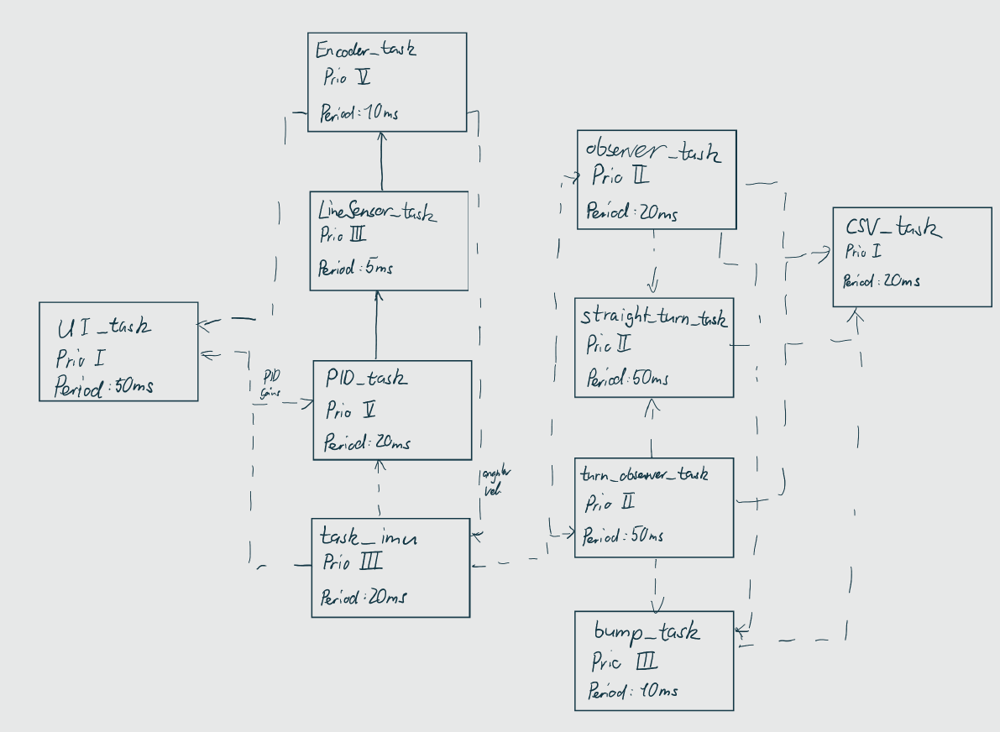
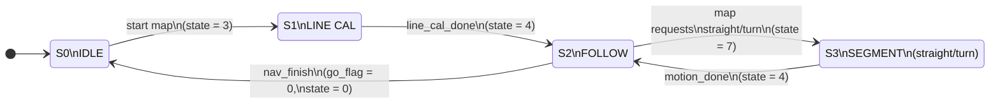

```mermaid
stateDiagram-v2
    direction LR

    [*] --> S0

    state "S0\nSTART\n(line cal)" as S0
    state "S1\nFORK 1\n(right path)" as S1
    state "S2\nDIAMOND" as S2
    state "S3\nDOT LINE\n(straight)" as S3
    state "S4\nFORK 2\n(right path)" as S4
    state "S5\nTOP CURVE\n(follow)" as S5
    state "S6\nMAZE ENTRY\n(straight)" as S6
    state "S7\nBRIDGE\n(straight)" as S7
    state "S8\nBRIDGE TURN\n(90°)" as S8
    state "S9\nBRIDGE EXIT\n(straight)" as S9
    state "S10\nWALL\n(approach\n+ back off)" as S10
    state "S11\nFINAL TURN\n(90°)" as S11
    state "S12\nFINISH DRIVE\n(straight)" as S12
    state "S13\nFINISH\n(stop)" as S13

    S0  --> S1: after line cal
    S1  --> S2: pass fork 1
    S2  --> S3: reach dot line
    S3  --> S4: segment done
    S4  --> S5: pass fork 2
    S5  --> S6: enter maze
    S6  --> S7: reach bridge
    S7  --> S8: segment done
    S8  --> S9: turn done
    S9  --> S10: off bridge
    S10 --> S11: back off wall
    S11 --> S12: turn done
    S12 --> S13: final distance
```

# ME405-Romi-Project

## Overview

This repository contains the software and documentation for a MicroPython Romi robot designed for navigation by usng coorperative multitasking, motor control, and sensors to follow a course. The Romi robot was built using a Nucleo L476RG. The line sensor, and bump sensors were purchased through Pololu. 

**Please use the table of contents in the top right corner to navigate the page.** 

 _The collaborators on this project are **Eric Lee, Roman Ruettimann, and Jonathan Enrique Corvera.** All three students each contributed to the software and hardware of the code equally._ 

**Project Goals & Features**

Our primary goal for this project was to build a Romi robot that can reliably complete a multi-checkpoint course using only onboard sensing and state estimation. The robot must follow lines, handle map segments without lines, and interact with physical obstacles while remaining fully autonomous. Along the way we focused on clean task structure, repeatable calibration routines, and tools that make debugging on the bench as easy as tuning on the course.

A key feature of our design is that everything runs on a cooperative multitasking framework. Each subsystem (line following, state estimation, bump sensing, mapping, and velocity control) is implemented as its own task with clearly defined shared variables. This keeps the code modular so that components like the observer or PID tuning can be improved without rewriting the rest of the project.

## Installation Instructions
All the python files included in the compile file is used to run the Romi system. The files in the compile folder should be imported directly into the Romi with a usb cord. The **main.py** is the central code. This code is reponsible for holding all the tasks and shared variables. The other files are classes and objects used to make the code function. To run the code, a terminal emulator, PuTTY,  was used to run commands and the code. Find the communication port number on your computer and select a baudrate of 115200 to open a PuTTY terminal. 

The main commands used on the PuTTY terminal is control C and Control D.  Control C allows the user to interrupt the code, while control D allows for you to reboot the code whenever you adjust the code. 

## Map Course Description 

### Map 
The image shown below is the course the Romi was tasked to navigate through. To complete the course, the use of line following, state estimation and bump sensing was required. Each large black dot indicates a checkpoint that needs to be reached to complete the assignment. Red cups are placed inside the dotted circles. When hit out of the dotted circle, 3 seconds is deducted from the team's official time. 

### Romi 

The robot used in this project is shown below. This robot consists of a chassis with multiple holes to attach many components.  

**Hardware Architecture Summary**

The hardware is organized around the Nucleo L476RG as the main controller, with separate boards for line sensing, inertial measurement, Bluetooth, and bump detection. The Romi chassis provides integrated motors and encoders, which connect directly to our custom Motor and Encoder driver classes. Power is supplied from an onboard battery pack sized to support continuous driving, sensing, and wireless communication for a full run of the course.

Physically, all sensor boards are mounted to give the robot a clear view of the track and obstacles. The 5-channel IR line sensor sits at the front of the chassis, the BNO055 IMU is mounted rigidly above the wheelbase, and the bump switches are placed at the leading edge to detect contact with cups and walls. This layout keeps wiring short and makes the robot easy to service between runs.

**Component List**
| Quantity | Component |
| -------- | --------- |
| 4 |  M2.5 x 8mm Standoff | 
| 4	| M2.5 x 10mm Standoff |
| 4 | M2.5 x 30mm Standoff |
| 4 |	M2.5 x 6mm Socket Head Cap Screw |
| 4	| M2.5 x 8mm Socket Head Cap Screw |
| 4	| M2.5 x 10mm Socket Head Cap Screw |
| 8	| M2.5 Nylon Lock Nuts |
| 8	| M2.5 Nylon Washer | 
| 1	| Acrylic Romi-to-Shoe Adapter |
| 1	| BNO055 IMU Breakout Board | 
| 1	| Unmodified Shoe of Brian |
| 1	| Modified Shoe of Brian |
| 2	| Nucleo L476RG |
| 1	| Romi Chassis w/ Motors, Encoders, Wheels, and Casters |
| 1 | 5 Channel IR Sensor | 
| 2 | Bumm Sensors | 
| 1 | IMU Sensor | 
| 1 | Bluetooth Module | 

**Critical Parameters**
| Parameter | Value |
| --------- | ----- | 
| Chassis Diameter | 	163 mm	 |
| Track Width (Wheel Center to Wheel Center)	| 141 mm |
| Wheel Radius | 35 mm |
| Gear Ratio (Exact) | 	119 25/33 ≈ 119.76	|
| Encoder Resolution (at Motor) |	1437 1/11 PPR ≈ 1437.1 PPR | 	
| Motor Voltage (Rated)	| 4.5 V	|
| Motor Torque (Stall)	| 177 N*mm @ 4.5V   283 N*mm @ 7.2V | 
| Motor Speed (No-Load)	| 150 RPM @ 4.5V   240 RPM @ 7.2V |
| Max Speed (Translational) |	550 mm/s @ 4.5V   880 mm/s @ 7.2V |

**Romi Dynamics**
The equations below show the state equations of the Romi

$$
\mathbf{x} =
\begin{bmatrix}
\Omega_L \\
\Omega_R \\
X \\
Y \\
\theta \\
s
\end{bmatrix},
\quad
\mathbf{u} =
\begin{bmatrix}
u_L \\
u_R
\end{bmatrix}
$$

$$
\dot{\mathbf{x}} =
\begin{bmatrix}
\dfrac{K}{\tau}u_L - \dfrac{1}{\tau}\Omega_L \\
\dfrac{K}{\tau}u_R - \dfrac{1}{\tau}\Omega_R \\
\dfrac{r}{2}\left(\Omega_R + \Omega_L\right)\cos\theta \\
\dfrac{r}{2}\left(\Omega_R + \Omega_L\right)\sin\theta \\
\dfrac{r}{L}\left(\Omega_R - \Omega_L\right) \\
\dfrac{r}{2}\left(\Omega_R + \Omega_L\right)
\end{bmatrix}
$$

$$
\mathbf{y} =
\begin{bmatrix}
\Omega_L \\
\Omega_R \\
X \\
Y \\
\theta \\
s
\end{bmatrix}
$$

## System_Architecture 

The Romi runs several tasks running using cotask.py to perform line following, state estimation, velocity PID, and map navigation. The following tasks were used to complete the project. Click each link for descriptions of each task. 

  - [PID_task](#PID_task)
  - [Encoder_task](#Encoder_task)
  - [LineSensor_task](#LineSensor_task)
  - [Follow_task](#Follow_task)
  - [task_imu](#task_imu)
  - [observer_task](#observer_task)
  - [test_observer_task](#test_observer_task)
  - [map_task](#map_task)

Shared variables were created by using task_share.py to allow for communication through tasks without blocking. Each task is set up as a generator function with each generator having a corresponding priority and run speed based on the importance of the task. This is shown at the bottom the very bottom of the main.py file. 

## Software Architecture Summary

On the software side, the project is structured as a set of cooperative tasks built on cotask.py and task_share.py. Low-level tasks handle encoders, IMU updates, and PID velocity control, while higher-level tasks handle line following, state estimation, and navigation logic for the map. Each task exchanges data only through well-defined shares, which keeps timing predictable and avoids blocking calls between modules.

The observer task uses a reduced-order Romi model to estimate forward distance, heading, and wheel speeds from encoder and IMU measurements. These estimated states are then consumed by the navigation and straight-line turning tasks to achieve target distances and angles without relying on external reference points. This model-based approach makes the robot much more repeatable when running on different floor surfaces or battery voltages.

## Calibration & Tuning Workflow

Before running the full course, we perform a short calibration and tuning workflow. The line sensor is calibrated first on both the white background and black tape to establish the correct brightness range for each channel. Then we verify the encoder readings and IMU output to ensure that the heading and yaw rate are stable and consistent with small test motions.

With the sensors validated, we tune the wheel-velocity PID controllers and observer gains using short straight-line and turning tests. These tests confirm that a commanded distance or angle results in the expected physical motion, and any residual errors are corrected with small overshoot compensations. This repeatable process allows us to quickly recover from hardware changes or recalibrate after the robot has been transported.

### Task Diagram 

To show the concurrent tasks running for the Romi project Map course a task diagram was created. 

### Finite State Machine

Global control-mode FSM

Map navigation FSM

## Task Descriptions

Shown below are descriptions of each task used to complete the term project. 
Use this linnk to return back to [System_Architecture](#System_Architecture) 

### PID_task

This task runs a closed-loop wheel velocity when the state is set to 2 or at 4. This PID was calibrated with individual kp, ki, and kd. The code includes a target speed regulator and set PID. Furthermore the controller includes a feedforward option in order to counter any disturbances. This feature intends to reduce any overshoot. 

### Encoder_task
The Encoder task updates the positions and velocities of the encoders based on open loop logginng. The values are converted into radians per second and filtered in order to accurately record the positions and velocity. 

### LineSensor_task
This task is responsible for running a simple calibration for the line sensor. By calling functions from the LineSensorArray class, the Romi is able to run calibrations for both the white and black lines. This is useful to instruct the robot to follow a line. 

### Follow_task
The follow task runs after the LineSensor task by taking the calibrated data and using it to follow the line. The centroid is calculated and adjusted based on the 5 IR line sensor signals. The motors are adjusted accordingly in order to keep the line centered to the sensor. 

### task_imu
The IMU task is responsible for indicated the heding, and yaw rate found using the IMU sensor. The data is recorded and the used for the observer tasks. 

### observer_task
By running an rk4 solver, the encoder angular velocity, speed of the Romi, turning angle, and turning speed are all calculated. The observer task is used for state estimation to accurately control the robots distance and turning angles. The state estimation is especially useful in the course to navigate through obstacles with no lines. 

$$
\begin{array}{rl}
\mathbf{x}_{n+1} &= \mathbf{x}_{n} + \frac{1}{6} \left(\mathbf{k}_1 + 2 \mathbf{k}_2 + 2 \mathbf{k}_3 + \mathbf{k}_4 \right) \Delta t
\end{array}
$$
where,
$$
\begin{array}{rll}
\mathbf{k}_1 &= \mathbf{f}(t, & \mathbf{x}_n)                                              \\
\mathbf{k}_2 &= \mathbf{f}(t+\frac{1}{2}\Delta t, & \mathbf{x}_n+\frac{1}{2} k_1 \Delta t) \\
\mathbf{k}_3 &= \mathbf{f}(t+\frac{1}{2}\Delta t, & \mathbf{x}_n+\frac{1}{2} k_2 \Delta t) \\
\mathbf{k}_4 &= \mathbf{f}(t+\Delta t, & \mathbf{x}_n+k_3 \Delta t).
\end{array}
$$

### test_observer_task
This task runs tests for the state estimation in order to confirm whether the romi is calibrated correctly to accurately move a certain distance or turn a certain angle. 

### map_task
The map task is responsible for navigating through the course shown in the first image above. The map uses line following, state estimation, and pid control to help complete each section of the course. Each task is called using states which are shared throughout all the tasks. The task is responsible for calibrating the line sensor, follow the line, and switch between line following and state esitmation. 

## Results

Line Sensor Following. The video below shows the Romi following a path 

https://github.com/user-attachments/assets/12b63d06-b12a-43de-abc6-85b22fbb766f

## Running a Full Course Attempt

A typical run begins by powering on the Romi, opening a serial terminal (e.g. PuTTY at 115200 baud), and rebooting the board with Ctrl+D. Once the system boots, the line sensor calibration sequence is performed and the state machine is placed into map-navigation mode. From there the robot autonomously follows the track, switches between line following and state estimation segments, and reacts to obstacles using the bump sensors.

During the run, telemetry such as encoder velocities, estimated distance, and heading can be streamed over the serial interface for logging and analysis. This data is invaluable for diagnosing misalignment, retuning a controller, or verifying that each checkpoint is reached in the correct order. At the end of the course, the robot stops automatically, and the logged data can be used to compare multiple runs or document performance improvements.

## Troubleshooting and calculations
Main issues related to line following of the robot. At the beginning the line sensor would not follow the line accurately, usually overshooting or lacking the response time to quickly adjust back to the line.

With the state estimation mode, the robot tends to overshoot a certain distance and the turning angle was slighty off. This was fixed by adding overshoot correction variables. 

## Takeaways 

The main takeaway from the project is learning how to structure code efficiently to perform tasks. Thorughout the quarter, focusing on what tasks required priority and at what frequency to run it the code became very important. Calibration also took a considerable amount of time to complete. The time to complete calibrations was mitigated by analyzing data and observing physical reactions of the robot. Finally, troubleshooting code was an important lesson to learn as it was important to dive deep into the root cause of the issue.

